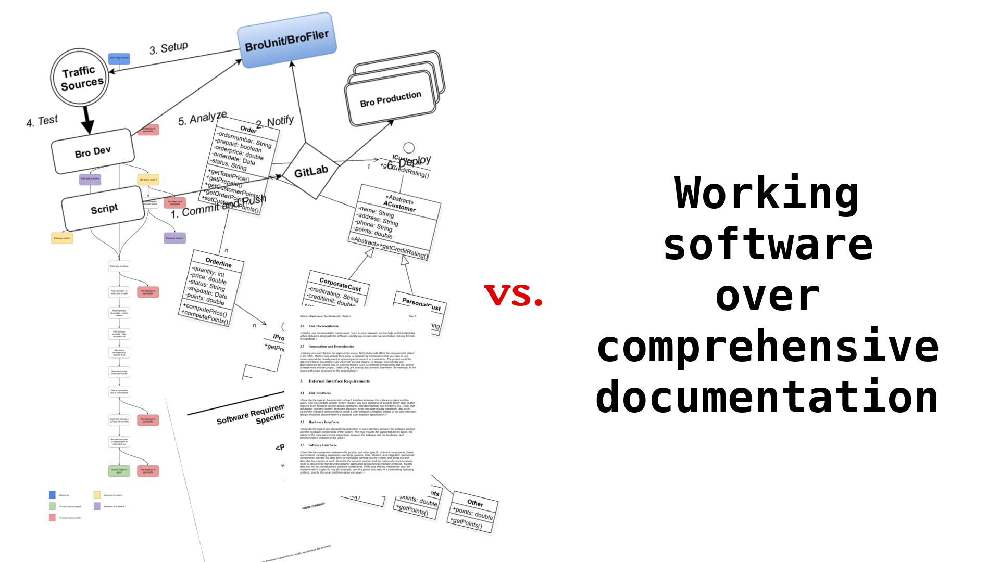

## Aims of this session

- Start a discussion on documentation methods in research software projects.

Notes at: [bit.ly/cw19-docs-workshop](http://bit.ly/cw19-docs-workshop)  
Please add your name and email if you want to contribute to a coherent document to be published.

Slides at: [bit.ly/cw19-docs-workshop-slides](http://bit.ly/cw19-docs-workshop-slides)

# Documentation is key for software sustainability

## Q: What and how should we actually document?

1. **What** must be documented? [Are there minimal and maximal sets of documentation types to cover?]
2. **How** should different documentation types be written or generated? [Does the type of documentation to be created dictate the form?]

*Underlying question:* How much - if any - "trad" software engineering documentation practices does sustainable research software need?

*My perspective:* New research software project with a focus on sustainability: [hexatomic.github.io](https://hexatomic.github.io).

## Tooling

Requirements and evaluation:

[http://bit.ly/doc-tooling-eval](http://bit.ly/doc-tooling-eval) (work in progress!)

## Documentation types?

::: {.columns}
:::: {.column width=0.3}
### Conceptual documentation 

- Requirements engineering
- System modeling
- Architectural design
- Object-oriented design
::::
:::: {.column width=0.3}
### Reference documentation

- Code comments
- API documentation
- README
- User guide
- Glossary
::::
:::: {.column width=0.3}
### Practice-based documentation

- How-tos
- Getting started
- Installation instructions
::::
:::

## Documentation methods?

## Documentation audiences?

- Users
- Developers
- Maintainers
- Managers
- Researchers (users + developers?)

## Questions / comments

Any questions before we dive into the discussion?

## Discussion

[bit.ly/cw19-docs-workshop](http://bit.ly/cw19-docs-workshop)

## Thank you!

Thanks!